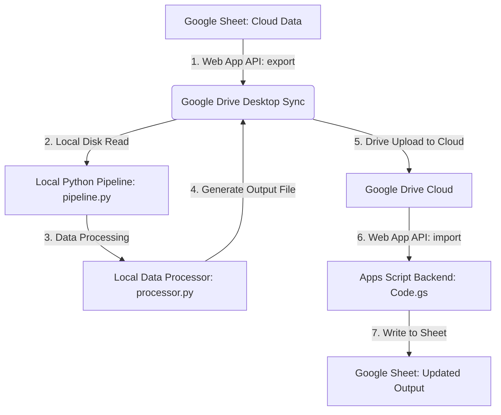

# Google Sheets & Google Apps Script Sync Pipeline (via Google Drive)

This repository provides a clean, generic template and workflow pattern for bridging Google Sheets (Cloud) and Python (Local) using **Google Drive for Desktop** and **clasp**. 

It enables developers to build data pipelines where heavy spreadsheet data parsing, intensive computations, or local machine scripts (e.g., machine learning, custom APIs, local databases) are executed in Python, with inputs automatically exported and output results automatically imported back to Google Sheets.

## Architecture Pattern



1. **Local Pipeline (`pipeline.py`)** triggers an API request to the Google Apps Script Web App.
2. **Apps Script Web App (`Code.gs`)** exports the target Google Sheet to an Excel file and saves it in a designated Google Drive folder.
3. **Google Drive for Desktop** syncs the file locally.
4. **Local Pipeline** detects the synced file, copies it, and runs the local Python processor (`processor.py`).
5. **Local Data Processor** completes operations and writes the processed output back to the local Google Drive folder.
6. **Google Drive for Desktop** syncs the output file to the cloud.
7. **Local Pipeline** triggers the Apps Script Web App import endpoint, which inserts/updates the sheet with the processed data.

---

## Prerequisites & Setup

### 1. Google Drive for Desktop
- Download and install [Google Drive for Desktop](https://www.google.com/drive/download/).
- Sign in to your Google Account.
- Ensure your synced files map locally (default: `G:\My Drive\my_sync_folder`).
- *If your sync path uses a different drive letter, update `G_DRIVE_DIR` in `pipeline.py`.*

### 2. Google Apps Script Configuration
- Create a new Google Sheet. Copy the Sheet ID from the browser URL.
- Go to **Extensions -> Apps Script**.
- Set up clasp locally:
  ```bash
  npm install -g @google/clasp
  clasp login
  clasp clone "<YOUR_SCRIPT_ID>"
  ```
- Enable the **Drive API** advanced service in your Apps Script project settings.

### 3. Local Python Setup
- Install dependencies:
  ```bash
  pip install pandas openpyxl
  ```

---

## File Structure

```
├── template/
│   ├── appsscript/
│   │   ├── Code.gs             # Google Apps Script Web App API endpoints
│   │   ├── index.html          # Simple Web App User Interface
│   │   └── appsscript.json     # Apps Script settings and API enablement
│   ├── pipeline.py             # Local pipeline orchestrator
│   ├── processor.py            # Local python Excel processor
│   └── run.bat                 # One-click execution batch file
└── README.md
```

---

## Usage

1. Open `template/appsscript/Code.gs` and update:
   - `SPREADSHEET_ID`: Your Google Sheet ID.
   - `FOLDER_NAME`: The name of the Google Drive folder to sync files to.
2. Push your Apps Script code to the cloud:
   - `clasp push`
3. Deploy your Apps Script as a **Web App** (Deploy -> New deployment -> Web app).
4. Run the local sync pipeline:
   - Run `template/run.bat` or `python template/pipeline.py` to trigger the end-to-end sync.
